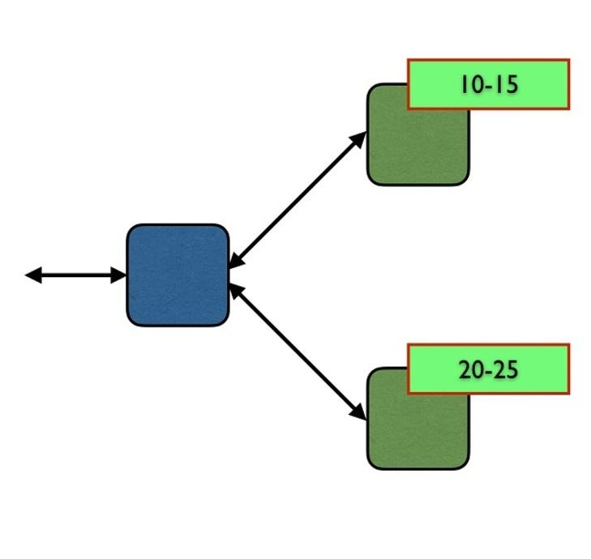

# FutureLearn - Erlang

## 3.13

### Exercise: Scaling the frequency server

**In this exercise we will look at how to scale up the frequency server.**

Use the comments on this step to share your approaches and solutions, and to discuss how you might implement ‘replication’ in Erlang.

The supporting file `frequency2.erl` is available (as a zip file) under ‘Downloads’ below.

---

#### Scaling up

Suppose that the frequency server needs to serve more frequencies. It would be possible to do this just by having a longer list of frequencies available, but it is likely that this scaling is required not only because more frequencies are needed but also because there are more requests to allocate and de-allocate them.

  

The idea here is that we can “shard” the handling of the frequencies, so that multiple processes are used to handle different subsets of them.

---

#### Implementation

Design a shared server which has two (old) frequency servers running: one process will be handling the frequencies 10–15 and the other process 20–25. In order for this to present the same API to its clients, you will also need to implement a front-end “router” process that will ensure that requests for allocation are routed to the appropriate server.

Obviously, a request to de-allocate a frequency will need to be routed to the appropriate back-end server, but what should be done in the case of allocation requests? Options include:

1. Alternately sending routing requests to one back-end server then the other.
2. Keeping a record in the front end of the number of frequencies remaining in each back-end server, and sending the allocation request to the server with the larger number; in the case of a tie another choice mechanism will be needed.

---

#### Replication

An alternative to sharding is to have two back end servers handling the whole set, and to (try to) maintain consistency between them. How would you implement this in Erlang?

---

#### Discussion

We would like to encourage you to use the comments on this step to discuss your solutions and your approaches to the replication question, as well as any practical experience you might have with scaling existing systems.

---

© University of Kent
